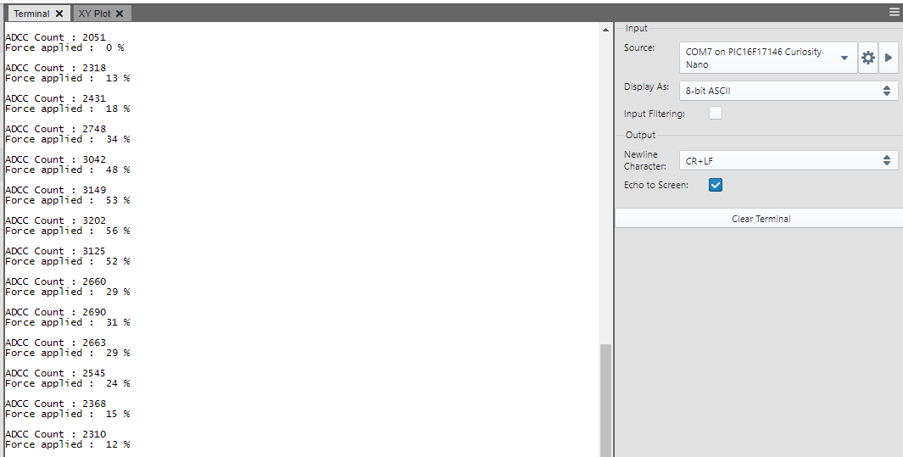
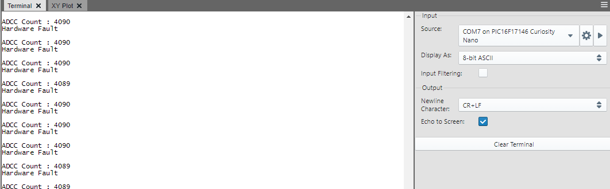
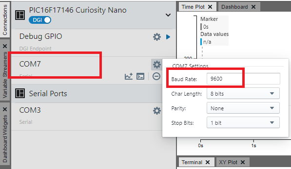
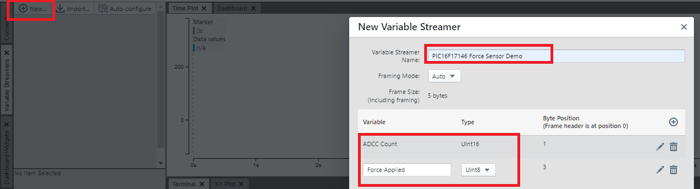

# Force Sensing Resistor interface using PIC16F17146 Microcontroller

## Introduction
This example aims to interface the Force Sensing Resistor(FSR) using the rich set of analog peripherals such as Operational Amplifier (OPA), 12-bit differential Analog-to-Digital Converter with Computation(ADCC), Digital-to-Analog Converter(DAC) and Fixed Voltage Reference(FVR) of PIC16F17146 microcontroller. The use of internal OPA and other analog peripherals helps to reduce BOM cost and minimizes number of external components used.

## Related Documentation
- [PIC16F17146 Product Page](https://www.microchip.com/product/PIC16F17146)
- [PIC16F17146 Data Sheet](https://www.microchip.com/DS40002343)

## Software Used
- MPLAB® X IDE [v6.00 or newer](https://www.microchip.com/mplab/mplab-x-ide)
- XC8 Compiler [v2.36.0 or newer](https://www.microchip.com/mplab/compilers)
- MPLAB® Code Configurator (MCC) [v5.1.2  or newer](https://www.microchip.com/mplab/mplab-code-configurator)
- Microchip PIC16F1xxxx Series Device Support [v1.13.178 or newer](https://packs.download.microchip.com/)

## Hardware Used
- [PIC16F17146 Curiosity Nano Board](https://www.microchip.com/development-tool/EV72J15A)
- [Curiosity Nano base board](https://www.microchip.com/development-tool/AC164162)
- [Proto Click](https://www.mikroe.com/proto-click)
- [FSR 400 Series](https://www.interlinkelectronics.com/fsr-400-series)
- Resistor (1.5kohm)

## Setup

PIC16F17146 Curiosity Nano board is used as development platform in this example. Curiosity Nano Base board is used for connecting proto click to the Curiosity Nano board. Proto click, placed in click slot 3, is used as general-purpose PCB to connect FSR and resistors to the OPA terminals. A feedback resistor RG of 1.5KΩ is connected from OPA output (pin RC2) to the negative terminal of OPA (pin RA2). One terminal of FSR is connected to pin RA2 and the other terminal is grounded. OPA is connected to ADCC internally without any external jumper cable.

### Pin Connection Table
|Microcontroller Pin| Signal Description |
|:------------------:|:-----------------:|
| RC2| OPA Output |
| RA2 |OPA Inverting Terminal* |
| RB7| UART TX|
| RB5 | UART RX |
| RC1 | LED0|

*Note: Connection from PIC16F17146 Curiosity Nano to click slot is not available for this pin. Jumper cable is used to make the required connections. Thus, short AN1 (RA2) and INT3 of Curiosity Nano Base Board.

## Implementation
The implementation of this example is carried out in 3 stages.

- Current to Voltage conversion using OPA
- Sampling of OPA output using differential ADCC
- Conversion of ADCC results to equivalent force and printing the results

### Current to Voltage conversion using OPA
A Force Sensing Resistor (FSR) converts the applied force into equivalent resistance. The current flowing through FSR is converted to corresponding voltage levels by OPA module which acts as a current to voltage converter. The FSR output is connected to the negative terminal of OPA. A feedback resistor RG of 1.5kΩ is also connected to the negative terminal of OPA. Vdd/2 is connected to the positive terminal of OPA. The voltage swing of OPA output ranges from 1.65V to 3.3V as Vdd is set to 3.3 V.
The output of OPA is described by the equation:

`VOUT = VDD/2 * [1 + RG/RFSR].  ------------------------------------------------------(1)`

### Sampling of OPA output using differential ADCC
The output of OPA is fed to positive channel of ADCC. An offset of 1.65V is supplied to the negative channel of ADCC using DAC. As the output of OPA is in the range of [1.65,3.3V] and negative terminal of ADCC is at constant voltage of 1.65V, the differential input voltage for ADCC conversion will be in the range of [0-1.65V]. FVR is used to provide a reference voltage of 2.048V to ADCC, thus by utilizing maximum ADCC range.

### Force calculation
As per the specifications of the FSR (Refer FSR Datasheet), ideally a maximum of 10N which corresponds to 1kg can be applied to the FSR. When no force is applied , FSR resistance is greater than 10 MΩ and output voltage of OPA is 1.65V *(Refer equation 1)*. When maximum force is applied, FSR resistance is around 1.25kΩ and the corresponding OPA output voltage is calculated as 3.63 V. As the OPA output is limited to 3.3V in this implementation, corresponding resistance of FSR is calculated approximately as 1.5kΩ. Refer equation below.

`RFSR = RG/((2 * VOUT/VDD) – 1)   -----------------------------------------(2)`

Therefore, the maximum force that can be applied and sensed using this implementation is approximately limited to 700g (corresponding to 1.5kΩ FSR resistance). When force is applied on FSR, the equivalent percentage of maximum force is calculated from ADCC count and is sent to serial terminal via EUSART.

The Data visualizer is used to illustrate the results which displays ADCC count & percentage of maximum force has applied.

## Demo Operation
Force applied on the surface of FSR is sensed continuously. The ADCC count and Force Applied is displayed using data visualizer. LED0 toggles every time data is sent to data visualizer using EUSART.

By default, ADCC count and Force Applied are displayed in graphical format. To setup data visualizer to view result in graphical format refer [Steps to open Time plot window in Data Visualizer](https://github.com/microchip-pic-avr-examples/pic16f17146-force-sensing-resistor-interface-mplab-mcc#steps-to-open-time-plot-window-in-data-visualizer).

ADCC count and Force Applied increases and decreases as per the applied force.

To view result in text format, comments the `#define GRAPH_FSR` line present in fsr_application.c file. To setup data visualizer to view result in terminal view refer [Steps to open Terminal window in Data Visualizer](https://github.com/microchip-pic-avr-examples/pic16f17146-force-sensing-resistor-interface-mplab-mcc#steps-to-open-terminal-window-in-data-visualizer).

When there is connection error or proto click is removed from the curiosity base board, "Hardware Fault" is printed on the terminal.

### Steps to open Terminal window in Data Visualizer
To see the messages in terminal window, curiosity nano board needs to be connected to terminal emulator. **Data Visualizer** can be used as terminal emulator. Follow below mentioned procedure to open Terminal Window in Data Visualizer.

Open the Data Visualizer tool which is available as a plugin in MPLAB X IDE.
1.	Open **COM16 Settings** window by clicking on COM16 tab. Set the **Baud Rate** to **9600**.
*Note: COM port number can be different depending on the availability of port*
2.	Click on *downward triangle* symbol on COM18 tab and select **Send to Terminal** option to start a connection.

### Steps to open Time plot window in Data Visualizer
To visualize the data in graphical format, time plot of Data Visualizer is used. Follow below mentioned procedure to open **Graph/Time plot** in Data Visualizer.

Open the Data Visualizer tool which is available as a plugin in MPLAB X IDE.
1.	Click on the Connections--> Serial Ports tab.
2.	Open COM16 Settings window by clicking on COM16 tab. Set the **Baud Rate** to 9600. Click Apply.
*Note: COM port number can be different depending on the availability of port*
3.	Click on right aligned triangle symbol on COM7 tab.
4.	Click on *Variable Streamer*.

5.  Click on *New Variable Streamer*.
6.	Add new variables for ADCC count (Int16) and Force Applied (Uint8) as shown in image below and Click on ‘Save’.

7.  Select source of the plot as selected CNANO port (in our case its COM16).
8.	Add plot for ADCC count and Force Applied.

## Peripheral Configuration using MCC
This section explains how to configure the peripherals using MPLAB X IDE with MCC plugin for recreation of the project.

Refer [Software Used](https://github.com/microchip-pic-avr-examples/pic16f17146-force-sensing-resistor-interface-mplab-mcc#software-used) section to install required tools to recreate the project.

Additional Links: [MCC Melody Technical Reference](https://onlinedocs.microchip.com/v2/keyword-lookup?keyword=MCC.MELODY.INTRODUCTION&redirect=true)

##### Peripheral Configuration Summary

| Peripherals               | Configuration                                                                                                                                                                                                                                                                                                                                                                                                  | Usage                                                                         |
|---------------------------|----------------------------------------------------------------------------------------------------------------------------------------------------------------------------------------------------------------------------------------------------------------------------------------------------------------------------------------------------------------------------------------------------------------|-------------------------------------------------------------------------------|
|    Clock Control    |    Clock source –   HFINTOSC HF Internal Clock – 4MHz Clock Divider   – 4                                                                                                                                                                                                                                                                                                         |    System  clock                                                                     |
|    OPA1               |    Enable Op Amp Op Amp Configuration – Direct connection to pins Positive Channel – Vdd/2 Negative Channel – OPA1IN- Negative Source Selection – OPA1IN2-                 |    Used as current to voltage convertor of FSR output                                         |
|    DAC1               |    Enable DAC Vdd – 3.3 Required ref – 1.65 DAC Positive reference selection – Vdd DAC Negative reference selection – VSS                                        |    Used  to supply offset voltage to ADCC                                |
|    ADCC               |    Input Configuration – Differential mode Operating mode – Burst average mode Result alignment – Right justified, two's compliment Positive reference – FVR Auto-conversion trigger – TMR2 Acquisition count – 5   Clock source – Fosc Clock divider – Fosc/2  Threshold Interrupt Mode – enabled  Repeat – 32   Accumulator Right shift – 5  ADTI Interrupt Enable – Enabled    |   Used for sampling of OPA output        |
|    FVR                |    FVR Enabled FVR_buffer 1   – 2x      |    Positive   reference voltage to ADCC                                |                                                                                                                                                                                                                                                                                                                                                                                           
|    TMR2               |    Disable Timer  Control Mode – Roll over pulse Start/Reset Option – Software Control Clock Source – MFINTOSC 32kHz Polarity – Rising edge Prescaler – 1:64 Postscaler – 1:3 Time Period – 1s |    Used to auto-trigger ADCC                                           |
|    UART1                | UART1 Driver    Requested Baudrate – 9600   UART PLIB Selector – EUSART1        EUSART1 PLIB   Redirect STDIO to EUSART      Enable Receive  Enable Transmit   Enable Serial Port         |    Send data to PC terminal   |

##### Peripheral Configuration using MCC
###### Clock Control

###### OPA1

###### DAC1

###### ADCC

###### FVR

###### TMR2

###### UART1 Driver

###### EUSART1 PLIB

*Note: The on-board debugger present on curiosity nano board has a virtual serial port (CDC) is connected to EUSART on the PIC16F17146 and provides an easy way to communicate with the target application through terminal software. Refer curiosity nano board user guide for more details.*

###### Pins

###### Pin Grid View

## Summary
This example demonstrated how a force sensor is interfaced to PIC16F17146 using built-in OPA and ADCC peripheral and measure the percentage of maximum force applied.
